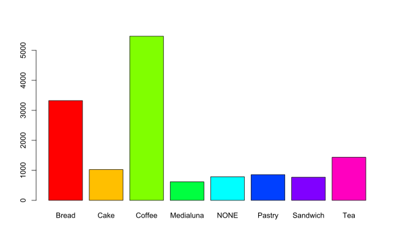

#Toto je datova vzorka transakcii z predaje pekarne

Tuto vzorku som ziskal na webovej stranke kaggle.com
v nej analyzujem ako sa vyvijal predaj jednotlivych poloziek za sledovany cas.
Cielom tohto zadania je zistit najpredavanejsie polozky, ich kombinaciu pocas jednej transakcii
a tak navrhnut katalog, v ktorom budu najziadanejsie polozky a ich zlavy tak nastavene,
aby boli spokojni aj zakaznici a aj predajca, aby bol najziskovejsi

```{r echo=FALSE}

transakcie = read.csv("BreadBasket_DMS.csv")
Bread = summary(droplevels(transakcie[which(transakcie$Item=="Bread"),4]))
Cake = summary(droplevels(transakcie[which(transakcie$Item=="Cake"),4]))
Coffee= summary(droplevels(transakcie[which(transakcie$Item=="Coffee"),4]))
Medialuna= summary(droplevels(transakcie[which(transakcie$Item=="Medialuna"),4]))
NONE= summary(droplevels(transakcie[which(transakcie$Item=="NONE"),4]))
Pastry= summary(droplevels(transakcie[which(transakcie$Item=="Pastry"),4]))
Sandwich= summary(droplevels(transakcie[which(transakcie$Item=="Sandwich"),4]))
Tea= summary(droplevels(transakcie[which(transakcie$Item=="Tea"),4]))


A = summary(transakcie$Item)
B = as.logical(summary(transakcie$Item)> 590)
C = levels(transakcie$Item)
pomocne = data.frame(A,B,C)
#summary(pomocne)

#pomocne[which(pomocne$B == TRUE),3]
sledovane = pomocne[which(pomocne$B == TRUE),3]
sledovane = droplevels(sledovane)
#sledovane
sledovane = c(Bread,Cake,Coffee,Medialuna,NONE,Pastry,Sandwich,Tea)

#sledovane
pct = round(sledovane/sum(sledovane)*100)
sledovane_1 = data.frame(A = c("Bread","Cake","Coffee","Medialuna","NONE","Pastry","Sandwich","Tea"), B=sledovane, C=pct)

j = paste(sledovane_1$A, sledovane_1$C, sep = " ")
j = paste(j, "%", sep = "")
pie(sledovane_1$B, labels = j, col = rainbow(length(sledovane_1$B)))
#barplot(sledovane, col = rainbow(length(sledovane)))

```




```{r echo=FALSE}
library(lubridate)
transakcie = read.csv("BreadBasket_DMS.csv")
transakcie_1 = transakcie
index_1 = 1:7
Dni = levels(transakcie$Date)
#day(as.POSIXlt(Dni, format="%Y-%m-%d"))
index = c(7 , rep_len(1:7,158))
Datumy = data.frame(Dni,index)
names(Datumy) = c("Date","Ind")
spojeneTabulky = merge(transakcie_1,Datumy, by="Date")
Dni = c("Pondelok", "Utorok","Streda","Stvrtok","Piatok","Sobota","Nedela")
pomocna_1 = data.frame(index_1,Dni)
names(pomocna_1) = c("Ind", "Dni")
spojeneTabulky = merge(spojeneTabulky, pomocna_1, by="Ind")
spojeneTabulky_1 = spojeneTabulky[,c(2,3,4,5,6,1)]
spojeneTabulky_1 = spojeneTabulky_1[order(spojeneTabulky_1$Date),]
spojeneTabulky_1$Dni = relevel(spojeneTabulky_1$Dni, "Nedela")
spojeneTabulky_1$Dni = relevel(spojeneTabulky_1$Dni, "Sobota")
spojeneTabulky_1$Dni = relevel(spojeneTabulky_1$Dni, "Piatok")
spojeneTabulky_1$Dni = relevel(spojeneTabulky_1$Dni, "Stvrtok")
spojeneTabulky_1$Dni = relevel(spojeneTabulky_1$Dni, "Streda")
spojeneTabulky_1$Dni = relevel(spojeneTabulky_1$Dni, "Utorok")
spojeneTabulky_1$Dni = relevel(spojeneTabulky_1$Dni, "Pondelok")

Dni_2 = summary(spojeneTabulky_1$Dni)
barplot(Dni_2,col = rainbow(length(Dni_2)))
plot(Dni_2)
lines(Dni_2)
```

