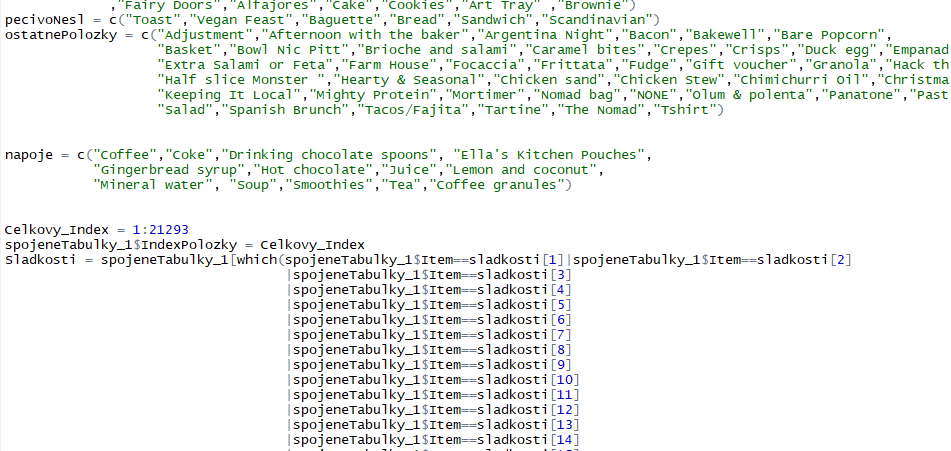

#Toto je datova vzorka transakcii z predaje pekarne

Tuto vzorku som ziskal na webovej stranke kaggle.com
v nej analyzujem ako sa vyvijal predaj jednotlivych poloziek za sledovany cas.
Cielom tohto zadania je zistit najpredavanejsie polozky, ich kombinaciu pocas jednej transakcii
a tak navrhnut katalog, v ktorom budu najziadanejsie polozky a ich zlavy tak nastavene,
aby boli spokojni aj zakaznici a aj predajca, aby bol najziskovejsi

```{r}
getwd()
transakcie = read.csv("BreadBasket_DMS.csv")
A = summary(transakcie$Item)
B = as.logical(summary(transakcie$Item)> 590)
C = levels(transakcie$Item)
pomocne = data.frame(A,B,C)

Bread = summary(droplevels(transakcie[which(transakcie$Item=="Bread"),4]))
Cake = summary(droplevels(transakcie[which(transakcie$Item=="Cake"),4]))
Coffee= summary(droplevels(transakcie[which(transakcie$Item=="Coffee"),4]))
Medialuna= summary(droplevels(transakcie[which(transakcie$Item=="Medialuna"),4]))
NONE= summary(droplevels(transakcie[which(transakcie$Item=="NONE"),4]))
Pastry= summary(droplevels(transakcie[which(transakcie$Item=="Pastry"),4]))
Sandwich= summary(droplevels(transakcie[which(transakcie$Item=="Sandwich"),4]))
Tea= summary(droplevels(transakcie[which(transakcie$Item=="Tea"),4]))


Nesledovane = sum(pomocne[pomocne$B==FALSE,1])
sum(pomocne[pomocne$B==FALSE,1])

for (i in 1:7008) {
  Nesledovane[i]= "Ostatne"
}
Nesledovane = as.factor(Nesledovane)

Nesledovane = summary(Nesledovane) 


sledovane = c(Bread,Cake,Coffee,Medialuna,NONE,Pastry,Sandwich,Tea,Nesledovane)

```

Najprv som si nacital data z pripravenej datovej vzorky ulozenej v .csv
potom pomocou summary nad stlpcom Item som zistil najpredavanejsie polozky.
Tie agregacie nad stlcpom Item som vyselektoval do noveho data.frame-u pomocne.
Do pomocne som pod pismenom A ulozil pocet jednotlivych poloziek.
Do B su nacitane hodnoty TRUE alebo FALSE, ktore bud splnali podmienku predaja nad 590
alebo nie. 590 hodnotu som si vybral, preto lebo mala mnozina tejto tabulky presahovala za celkove
sledovvane obdobie tuto uvedenu hodnotu. Ked som spravil spravil rozdiel hodnot medzi
najpredavanejsimi polozkami (nad 590) a ostatnymi tak mi vysiel vysledok okolo 7008 poloziek,
ktore som nikam nezaradil, tak som spravil cyklus v ktorom som priradil premennej nesledovane n-krat
Ostatne a potom som premenil typ premennej z character na typ faktor. Do premennej sledovane
som ulozil vytriedene polozky. Vytvoril som si premennu pct, v ktorej som vypocital percentualne
rodelenie dat podla poloziek. V data frame-i sledovane_1 su ulozene zosumarizovane 
hodnoty A - levely faktorov vytriedenych poloziek, B - pocty jednotlivych levelov, C - percenta.
Tento data frame bol vychodiskovym na vykreslenie nasledujucich grafov.

```{r}
pct = round(sledovane/sum(sledovane)*100)
sledovane_1 = data.frame(A = c("Bread","Cake","Coffee","Medialuna","NONE","Pastry","Sandwich","Tea","Ostatne"), B=sledovane, C=pct)
j = paste(sledovane_1$A, sledovane_1$C, sep = " ")
j = paste(j, "%", sep = "")
pie(sledovane_1$B, labels = j, col = rainbow(length(sledovane_1$B)), main = "Graf s rozdelenim predanych poloziek za sledovane obdobie")
#barplot(sledovane, col = rainbow(length(sledovane)))
```


Tento graf obsahuje na y-osy pocet celkovo predanych poloziek daneho typu 
a x-os nazvy tych poloziek.

Podla vyselektovanych dat sme mohli postrehnut, 
ze najpredavanejsie polozky su Chlieb, kava, kolac a caj. 

```{r}
library(lubridate)
spojeneTabulky_1 = readRDS("final.rda")
summary(spojeneTabulky_1)
```

Pri predaji je dolezity aj cas predaja,
takze pomocou kniznice lubridate som si vytriedil dni v mesiaci
a podla kalendara som si nastavil nazvi dni v mesiaci,
aby som na nasledujucich grafoch znazornil suvislosti medzi 
predajom dnom v tyzdni. Pomocou prikazu relevel som preusporiadal 
dni v tyzdni.

```{r}
spojeneTabulky_1$Dni = relevel(spojeneTabulky_1$Dni, "Nedela")
spojeneTabulky_1$Dni = relevel(spojeneTabulky_1$Dni, "Sobota")
spojeneTabulky_1$Dni = relevel(spojeneTabulky_1$Dni, "Piatok")
spojeneTabulky_1$Dni = relevel(spojeneTabulky_1$Dni, "Stvrtok")
spojeneTabulky_1$Dni = relevel(spojeneTabulky_1$Dni, "Streda")
spojeneTabulky_1$Dni = relevel(spojeneTabulky_1$Dni, "Utorok")
spojeneTabulky_1$Dni = relevel(spojeneTabulky_1$Dni, "Pondelok")
Dni_2 = summary(spojeneTabulky_1$Dni)
barplot(Dni_2,col = rainbow(length(Dni_2)), main = "Pocet poloziek predanych v jednotlivych dnoch pocas tyzdna")
```

Z tohto grafu vyplyva, ze najviac poloziek sa preda cez tyzden v stredu 
a cez vikend v sobotu.


```{r}
library(lattice)
opilun = data.frame(table(spojeneTabulky_1$hms.Hodiny..hour,spojeneTabulky_1$Dni))
najpredavanejsie_casy = table(spojeneTabulky_1$Item,spojeneTabulky_1$hms.Hodiny..hour)
najpredavanejsie_casy = data.frame(najpredavanejsie_casy)
xyplot(Freq~ Var1| Var2, data=opilun)

```

Z uvedeneho grafu vyplyva to, ze pracovna doba predaja
je od 7:00 rana do 1:00 nasledujuceho dna.
Najpredavanejsie casy pocas tyzdna su vo vsetkych dnoch 
okolo obeda medzi 11:00 a 14:00 najviac samozrejme v Stredu
ako sme sa dozvedeli v predchadzajucich grafoch.

```{r}
G = najpredavanejsie_casy[which(najpredavanejsie_casy$Freq>33),1:3]
G$Var1 = droplevels(G$Var1)
xyplot(Freq~ Var2| Var1, data=G)

```

Dalej na tychto grafoch sme zistili, ze kava sa predava
najviac z rannych hodin a chlieb sa predava okolo 11:00 a 12:00 hodiny


##Modelovanie 

V tejto casti na zaklade spoznanych dat a sa pokusime namodelovat
urcite vysledky. 

###Naivny Bayes


```{r echo=FALSE}
sladkosti = c("Victorian Sponge","Vegan mincepie","Valentine's card","Tiffin","Truffles","The BART","Spread","Siblings"
             ,"Scone","Raw bars","Raspberry shortbread sandwich","Pick and Mix Bowls","My-5 Fruit Shoot","Muffin","Muesli"
             ,"Medialuna","Kids biscuit","Chocolates","Honey","Cherry me Dried fruit","Dulce de Leche","Bread Pudding"
             ,"Fairy Doors","Alfajores","Cake","Cookies","Art Tray" ,"Brownie")
pecivoNesl = c("Toast","Vegan Feast","Baguette","Bread","Sandwich","Scandinavian")
ostatnePolozky = c("Adjustment","Afternoon with the baker","Argentina Night","Bacon","Bakewell","Bare Popcorn",                 
                   "Basket","Bowl Nic Pitt","Brioche and salami","Caramel bites","Crepes","Crisps","Duck egg","Empanadas",
                   "Extra Salami or Feta","Farm House","Focaccia","Frittata","Fudge","Gift voucher","Granola","Hack the stack",               
                   "Half slice Monster ","Hearty & Seasonal","Chicken sand","Chicken Stew","Chimichurri Oil","Christmas common","Jam","Jammie Dodgers",               
                   "Keeping It Local","Mighty Protein","Mortimer","Nomad bag","NONE","Olum & polenta","Panatone","Pastry","Polenta","Postcard",                      
                   "Salad","Spanish Brunch","Tacos/Fajita","Tartine","The Nomad","Tshirt")


napoje = c("Coffee","Coke","Drinking chocolate spoons", "Ella's Kitchen Pouches",
           "Gingerbread syrup","Hot chocolate","Juice","Lemon and coconut",
           "Mineral water", "Soup","Smoothies","Tea","Coffee granules")


Celkovy_Index = 1:21293
spojeneTabulky_1$IndexPolozky = Celkovy_Index
Sladkosti = spojeneTabulky_1[which(spojeneTabulky_1$Item==sladkosti[1]|spojeneTabulky_1$Item==sladkosti[2]
                                   |spojeneTabulky_1$Item==sladkosti[3]
                                   |spojeneTabulky_1$Item==sladkosti[4]
                                   |spojeneTabulky_1$Item==sladkosti[5]
                                   |spojeneTabulky_1$Item==sladkosti[6]
                                   |spojeneTabulky_1$Item==sladkosti[7]
                                   |spojeneTabulky_1$Item==sladkosti[8]
                                   |spojeneTabulky_1$Item==sladkosti[9]
                                   |spojeneTabulky_1$Item==sladkosti[10]
                                   |spojeneTabulky_1$Item==sladkosti[11]
                                   |spojeneTabulky_1$Item==sladkosti[12]
                                   |spojeneTabulky_1$Item==sladkosti[13]
                                   |spojeneTabulky_1$Item==sladkosti[14]
                                   |spojeneTabulky_1$Item==sladkosti[15]
                                   |spojeneTabulky_1$Item==sladkosti[16]
                                   |spojeneTabulky_1$Item==sladkosti[17]
                                   |spojeneTabulky_1$Item==sladkosti[18]
                                   |spojeneTabulky_1$Item==sladkosti[19]
                                   |spojeneTabulky_1$Item==sladkosti[20]
                                   |spojeneTabulky_1$Item==sladkosti[21]
                                   |spojeneTabulky_1$Item==sladkosti[22]
                                   |spojeneTabulky_1$Item==sladkosti[23]
                                   |spojeneTabulky_1$Item==sladkosti[24]
                                   |spojeneTabulky_1$Item==sladkosti[25]
                                   |spojeneTabulky_1$Item==sladkosti[26]
                                   |spojeneTabulky_1$Item==sladkosti[27]
                                   |spojeneTabulky_1$Item==sladkosti[28]
                                   ),]


OstatnePolozky = spojeneTabulky_1[which(spojeneTabulky_1$Item==ostatnePolozky[1]|spojeneTabulky_1$Item==ostatnePolozky[2]
                                   |spojeneTabulky_1$Item==ostatnePolozky[3]
                                   |spojeneTabulky_1$Item==ostatnePolozky[4]
                                   |spojeneTabulky_1$Item==ostatnePolozky[5]
                                   |spojeneTabulky_1$Item==ostatnePolozky[6]
                                   |spojeneTabulky_1$Item==ostatnePolozky[7]
                                   |spojeneTabulky_1$Item==ostatnePolozky[8]
                                   |spojeneTabulky_1$Item==ostatnePolozky[9]
                                   |spojeneTabulky_1$Item==ostatnePolozky[10]
                                   |spojeneTabulky_1$Item==ostatnePolozky[11]
                                   |spojeneTabulky_1$Item==ostatnePolozky[12]
                                   |spojeneTabulky_1$Item==ostatnePolozky[13]
                                   |spojeneTabulky_1$Item==ostatnePolozky[14]
                                   |spojeneTabulky_1$Item==ostatnePolozky[15]
                                   |spojeneTabulky_1$Item==ostatnePolozky[16]
                                   |spojeneTabulky_1$Item==ostatnePolozky[17]
                                   |spojeneTabulky_1$Item==ostatnePolozky[18]
                                   |spojeneTabulky_1$Item==ostatnePolozky[19]
                                   |spojeneTabulky_1$Item==ostatnePolozky[20]
                                   |spojeneTabulky_1$Item==ostatnePolozky[21]
                                   |spojeneTabulky_1$Item==ostatnePolozky[22]
                                   |spojeneTabulky_1$Item==ostatnePolozky[23]
                                   |spojeneTabulky_1$Item==ostatnePolozky[24]
                                   |spojeneTabulky_1$Item==ostatnePolozky[25]
                                   |spojeneTabulky_1$Item==ostatnePolozky[26]
                                   |spojeneTabulky_1$Item==ostatnePolozky[27]
                                   |spojeneTabulky_1$Item==ostatnePolozky[28]
                                   |spojeneTabulky_1$Item==ostatnePolozky[29]
                                   |spojeneTabulky_1$Item==ostatnePolozky[30]
                                   |spojeneTabulky_1$Item==ostatnePolozky[31]
                                   |spojeneTabulky_1$Item==ostatnePolozky[32]
                                   |spojeneTabulky_1$Item==ostatnePolozky[33]
                                   |spojeneTabulky_1$Item==ostatnePolozky[34]
                                   |spojeneTabulky_1$Item==ostatnePolozky[35]
                                   |spojeneTabulky_1$Item==ostatnePolozky[36]
                                   |spojeneTabulky_1$Item==ostatnePolozky[37]
                                   |spojeneTabulky_1$Item==ostatnePolozky[38]
                                   |spojeneTabulky_1$Item==ostatnePolozky[39]
                                   |spojeneTabulky_1$Item==ostatnePolozky[40]
                                   |spojeneTabulky_1$Item==ostatnePolozky[41]
                                   |spojeneTabulky_1$Item==ostatnePolozky[42]
                                   |spojeneTabulky_1$Item==ostatnePolozky[43]
                                   |spojeneTabulky_1$Item==ostatnePolozky[44]
                                   |spojeneTabulky_1$Item==ostatnePolozky[45]
                                   |spojeneTabulky_1$Item==ostatnePolozky[46]
                                   
),]

PecivoNesl = spojeneTabulky_1[which(spojeneTabulky_1$Item==pecivoNesl[1]|spojeneTabulky_1$Item==pecivoNesl[2]
                                    |spojeneTabulky_1$Item==pecivoNesl[3]
                                    |spojeneTabulky_1$Item==pecivoNesl[4]
                                    |spojeneTabulky_1$Item==pecivoNesl[5]
                                    |spojeneTabulky_1$Item==pecivoNesl[6]
                                    
                                    
),]

Napoje = spojeneTabulky_1[which(spojeneTabulky_1$Item==napoje[1]|spojeneTabulky_1$Item==napoje[2]
                                  |spojeneTabulky_1$Item==napoje[3]
                                  |spojeneTabulky_1$Item==napoje[4]
                                  |spojeneTabulky_1$Item==napoje[5]
                                  |spojeneTabulky_1$Item==napoje[6]
                                  |spojeneTabulky_1$Item==napoje[7]
                                  |spojeneTabulky_1$Item==napoje[8]
                                  |spojeneTabulky_1$Item==napoje[9]
                                  |spojeneTabulky_1$Item==napoje[10]
                                  |spojeneTabulky_1$Item==napoje[11]
                                  |spojeneTabulky_1$Item==napoje[12]
                                  |spojeneTabulky_1$Item==napoje[13]
),]  
Napoje$Polozky = "Napoj"
OstatnePolozky$Polozky = "OstatnePolozky"
PecivoNesl$Polozky = "PecivoNesladke"
Sladkosti$Polozky = "Sladkosti"
spojeneTabulky_1_1 =  rbind(Napoje,PecivoNesl,OstatnePolozky,Sladkosti)
spojeneTabulky_1_1 = spojeneTabulky_1_1[order(spojeneTabulky_1_1$IndexPolozky),]
spojeneTabulky_1_1$Polozky = as.factor(spojeneTabulky_1_1$Polozky)
```
Pomocou tychto algoritmov som si vyclenil jednotlive polozky zo stlpca Item na vyssie kategorie 
ako napoje, ostatne(nezaradene polozky) polozky, Pecivo nesladke(Chlieb rozok a pod.), Sladkosti.

Na dalsich algoritmoch budem skusat modelovat takto roztriedene data.
Najprv nastavim vzorkovanie na hodnotu napr. 200
Do premennej Vzorka som ulozil index-i na rotriedene data, na trenovaciu a testovaciu cast.
Rozdelenie bolo v pomere 70% ku 30%. Vytvoril som pomocny data.frame v ktorom
som spojeneTabulky_1_1.tren vynechal cielovy atribut v tomto pripade
roztriedene polozky(napoje, Sladkosti a pod.)
do data.frame-u spojeneTabulky_1_1.tren_spoj som uviedeol stlpec sledovaneho atributu.
Pouzil som kniznicu e1071, do premennej klasifikacia.trenovacia som pouzil funkciu
naiveBayes a do argumentu som dal data.frame bez cieloveho atributu a s cielovym.
Vykreslil som si kontigencnu tabulku a vysledok som zapisal do pomocneho data.frame-u
vyhodnotenie a z tohto data.frame-u som vypocital celkovu uspesnost za trenovaciu cast.
Co sa tyka testovacej mnoziny tak som do funkcie predict za argument newdata pridal testovaciu cast 
a ostatny postup bol obdobny.



```{r}
set.seed(200)
Vzorka = sample(2,nrow(spojeneTabulky_1_1),replace = TRUE, prob = c(0.7,0.3))

spojeneTabulky_1_1.tren = spojeneTabulky_1_1[Vzorka==1,c(-4,-12)]
spojeneTabulky_1_1.tren_spoj = spojeneTabulky_1_1[Vzorka==1,12]
spojeneTabulky_1_1.test = spojeneTabulky_1_1[Vzorka==2,c(-4,-12)]
spojeneTabulky_1_1.test_spoj = spojeneTabulky_1_1[Vzorka==2,12]

library(e1071)
klasifikacia.trenovacia = naiveBayes(spojeneTabulky_1_1.tren,spojeneTabulky_1_1.tren_spoj)
table(predict(klasifikacia.trenovacia,spojeneTabulky_1_1.tren),spojeneTabulky_1_1.tren_spoj)
uspechKlasifikacie = data.frame(table(predict(klasifikacia.trenovacia,spojeneTabulky_1_1.tren),spojeneTabulky_1_1.tren_spoj))
vyhodnotenie = uspechKlasifikacie [which(uspechKlasifikacie$Var1== uspechKlasifikacie$spojeneTabulky_1_1.tren_spoj & uspechKlasifikacie$Freq>0),]
uspesnost = sum(vyhodnotenie$Freq)/sum(uspechKlasifikacie$Freq)*100
uspesnost

table(predict(klasifikacia.trenovacia,newdata = spojeneTabulky_1_1.test),spojeneTabulky_1_1.test_spoj)
uspechKlasifikacie_2 = data.frame(table(predict(klasifikacia.trenovacia,newdata = spojeneTabulky_1_1.test),spojeneTabulky_1_1.test_spoj))
vyhodnotenie_2 = uspechKlasifikacie_2 [which(uspechKlasifikacie_2$Var1== uspechKlasifikacie_2$spojeneTabulky_1_1.test_spoj & uspechKlasifikacie_2$Freq>0),]
uspesnost = sum(vyhodnotenie_2$Freq)/sum(uspechKlasifikacie_2$Freq)*100
uspesnost
```

###Rozhodovaci strom

```{r}
library(party)
spojeneTabulky_1_1.tren_1 = spojeneTabulky_1_1[Vzorka==1,]
spojeneTabulky_1_1.test_1 = spojeneTabulky_1_1[Vzorka==2,]


myFormula = Polozky ~  Dni + hms.Minuty..minutes + hms.Hodiny..hour
spojeneTabulky_1_1.ctree = ctree(myFormula, data = spojeneTabulky_1_1.tren_1)
plot(spojeneTabulky_1_1.ctree, type="simple")
plot(spojeneTabulky_1_1.ctree)
table(predict(spojeneTabulky_1_1.ctree),spojeneTabulky_1_1.tren_1$Polozky)

table(predict(spojeneTabulky_1_1.ctree, newdata=spojeneTabulky_1_1.test_1), spojeneTabulky_1_1.test_1$Polozky)
```

Podla modelovania Naivneho Bayesa a rozhodovacieho stromu sa podarilo dosiahnut max do 30 uspesnosti. 
Svedci to o tom, ze pouzite tieto dva metoda maju slabu podporu, pre tento typ ulohy
data mining-u.

###Asociacne pravidla

najprv si este raz nacitame data zo suboru ale s podporou funkcie
specialne urcenej na tento typ prikladu z baliku arules a arulesViz

```{r}
library(arules)
library(arulesViz)

selektovaneTransakcie = read.transactions("BreadBasket_DMS.csv",format="single",cols=c(3,4),sep=",")
summary(itemFrequency(selektovaneTransakcie))
```

Podla sumarizacnej tabulky vidime, ze maximalnu frekvenciu poloziek 
dosahujeme pri bode 0,4820079.
Teraz vypocitame minimalnu podporu(support) tak,
ze podelime 30 (lebo vsetkych poloziek je cez 90, tak aspon jednu tretinu uspesne prehladali)
s dlzkou celkoveho obsahu premennej selektovaneTransakcie

```{r}
30/length(selektovaneTransakcie)
```


Pomocou algoritmu apriori zanalizujeme 
transakcie
ako vstupne parametre urcime
podpora = 0,0045 a spolahlivost = 50% = 0,5

```{r}
pravidla <- apriori(selektovaneTransakcie,parameter=list(support=0.0045,confidence=.5))
inspect(pravidla)

```

Grafy

```{r}
plot(pravidla, measure=c("support","lift"), shading="confidence")
plot(pravidla, method = "two-key plot")
plot(pravidla, method="graph")
plot(pravidla, method="grouped")
plot(pravidla, method="paracoord", control=list(reorder=TRUE))

```


