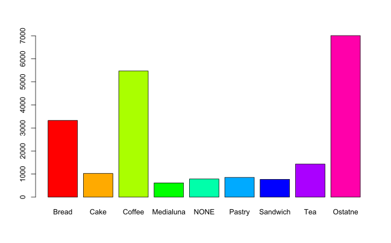

#Toto je datova vzorka transakcii z predaje pekarne

Tuto vzorku som ziskal na webovej stranke kaggle.com
v nej analyzujem ako sa vyvijal predaj jednotlivych poloziek za sledovany cas.
Cielom tohto zadania je zistit najpredavanejsie polozky, ich kombinaciu pocas jednej transakcii
a tak navrhnut katalog, v ktorom budu najziadanejsie polozky a ich zlavy tak nastavene,
aby boli spokojni aj zakaznici a aj predajca, aby bol najziskovejsi

```{r}
getwd()
transakcie = read.csv("BreadBasket_DMS.csv")
Bread = summary(droplevels(transakcie[which(transakcie$Item=="Bread"),4]))
Cake = summary(droplevels(transakcie[which(transakcie$Item=="Cake"),4]))
Coffee= summary(droplevels(transakcie[which(transakcie$Item=="Coffee"),4]))
Medialuna= summary(droplevels(transakcie[which(transakcie$Item=="Medialuna"),4]))
NONE= summary(droplevels(transakcie[which(transakcie$Item=="NONE"),4]))
Pastry= summary(droplevels(transakcie[which(transakcie$Item=="Pastry"),4]))
Sandwich= summary(droplevels(transakcie[which(transakcie$Item=="Sandwich"),4]))
Tea= summary(droplevels(transakcie[which(transakcie$Item=="Tea"),4]))

A = summary(transakcie$Item)
B = as.logical(summary(transakcie$Item)> 590)
C = levels(transakcie$Item)
pomocne = data.frame(A,B,C)


Nesledovane = sum(pomocne[pomocne$B==FALSE,1])
sum(pomocne[pomocne$B==FALSE,1])

for (i in 1:7008) {
  Nesledovane[i]= "Ostatne"
}
Nesledovane = as.factor(Nesledovane)

Nesledovane = summary(Nesledovane) 

sledovane = pomocne[which(pomocne$B == TRUE),3]
sledovane = droplevels(sledovane)
sledovane = c(Bread,Cake,Coffee,Medialuna,NONE,Pastry,Sandwich,Tea,Nesledovane)

```

Pomocou tychto algoritmov som si vyselektoval data, 
v ktorych su rozdelene polozky na najviac predavane a ostatne.

```{r}
pct = round(sledovane/sum(sledovane)*100)
sledovane_1 = data.frame(A = c("Bread","Cake","Coffee","Medialuna","NONE","Pastry","Sandwich","Tea","Ostatne"), B=sledovane, C=pct)
j = paste(sledovane_1$A, sledovane_1$C, sep = " ")
j = paste(j, "%", sep = "")
pie(sledovane_1$B, labels = j, col = rainbow(length(sledovane_1$B)), main = "Graf s rozdelenim predanych poloziek za sledovane obdobie")
#barplot(sledovane, col = rainbow(length(sledovane)))
```


Podla vyselektovanych dat sme mohli postrehnut, 
ze najpredavanejsie polozky su Chlieb, kava, kolac a caj. 

```{r}
library(lubridate)
#install.packages("tidyverse")
transakcie_1 = transakcie
#summary(transakcie$Date)
#levels(transakcie$Date)
Dni = levels(transakcie$Date)
day(as.POSIXlt(Dni, format="%Y-%m-%d"))
#Dni
index = c(7 , rep_len(1:7,158))
#index
Datumy = data.frame(Dni,index)
names(Datumy) = c("Date","Ind")
spojeneTabulky = merge(transakcie_1,Datumy, by="Date")

index_1 = 1:7
Dni = c("Pondelok", "Utorok","Streda","Stvrtok","Piatok","Sobota","Nedela")
pomocna_1 = data.frame(index_1,Dni)
names(pomocna_1) = c("Ind", "Dni")
spojeneTabulky = merge(spojeneTabulky, pomocna_1, by="Ind")
spojeneTabulky_1 = spojeneTabulky[,c(2,3,4,5,6,1)]
spojeneTabulky_1 = spojeneTabulky_1[order(spojeneTabulky_1$Date),]

spojeneTabulky_1$Dni = relevel(spojeneTabulky_1$Dni, "Nedela")
spojeneTabulky_1$Dni = relevel(spojeneTabulky_1$Dni, "Sobota")
spojeneTabulky_1$Dni = relevel(spojeneTabulky_1$Dni, "Piatok")
spojeneTabulky_1$Dni = relevel(spojeneTabulky_1$Dni, "Stvrtok")
spojeneTabulky_1$Dni = relevel(spojeneTabulky_1$Dni, "Streda")
spojeneTabulky_1$Dni = relevel(spojeneTabulky_1$Dni, "Utorok")
spojeneTabulky_1$Dni = relevel(spojeneTabulky_1$Dni, "Pondelok")

```

Pri predaji je dolezity aj cas predaja,
takze pomocou kniznice lubridate som si vytriedil dni v mesiaci
a podla kalendara som si nastavil nazvi dni v mesiaci,
aby som na nasledujucich grafoch znazornil suvislosti medzi 
predajom dnom v tyzdni.

```{r}
Dni_2 = summary(spojeneTabulky_1$Dni)
barplot(Dni_2,col = rainbow(length(Dni_2)), main = "Pocet poloziek predanych v jednotlivych dnoch pocas tyzdna")
```

Z tohto grafu vyplyva, ze najviac poloziek sa preda cez tyzden v stredu 
a cez vikend v sobotu.

```{r}
Hodiny = spojeneTabulky_1$Time
#View(Hodiny)
index_casu = 1:21293
Cas = data.frame(Hodiny, index_casu)
#View(hms(Hodiny))
Hodiny_1 = data.frame(hms(Hodiny)@hour,hms(Hodiny)@minute, index_casu)
#View(Hodiny_1)
spojeneTabulky_1$index_casu = 1:21293
spojeneTabulky_2 = merge(spojeneTabulky_1, Hodiny_1, by = "index_casu")
spojeneTabulky_1 = spojeneTabulky_2[,c(2:9)]
#corrgram(spojeneTabulky_1)
opilun = data.frame(table(spojeneTabulky_1$hms.Hodiny..hour,spojeneTabulky_1$Dni))

```

Pomocou kniznice lubridate si vytriedime jednotlive hodiny predaja 
a pozrieme sa na najpredavanejsie casy pocas dna.

```{r}
library(lattice)

najpredavanejsie_casy = table(spojeneTabulky_1$Item,spojeneTabulky_1$hms.Hodiny..hour)
najpredavanejsie_casy = data.frame(najpredavanejsie_casy)
xyplot(Freq~ Var1| Var2, data=opilun)

```

Z uvedeneho grafu vyplyva to, ze pracovna doba predaja
je od 7:00 rana do 1:00 nasledujuceho dna.
Najpredavanejsie casy pocas tyzdna su vo vsetkych dnoch 
okolo obeda medzi 11:00 a 14:00 najviac samozrejme v Stredu
ako sme sa dozvedeli v predchadzajucich grafoch.

```{r}
G = najpredavanejsie_casy[which(najpredavanejsie_casy$Freq>33),1:3]
G$Var1 = droplevels(G$Var1)
xyplot(Freq~ Var2| Var1, data=G)

```

Dalej na tychto grafoch sme zistili, ze kava sa predava
najviac z rannych hodin a chlieb sa predava okolo 11:00 a 12:00 hodiny

```{r}
spojeneTabulky_1$Mesiace = month(spojeneTabulky_1$Date)
spojeneTabulky_1$Roky= year(spojeneTabulky_1$Date)
spojeneTabulky_1 = spojeneTabulky_1[order(spojeneTabulky_1$Transaction),]
barplot(spojeneTabulky_1[which(spojeneTabulky_1$Mesiace == 10),"Transaction"], main = "Pocet celkovych poloziek
        zauctovana na jednu transakciu za celkovy pocet transakcii", xlab= "transakcie")
```

Tento barplot zobrazil celkove poradie zauctovanych poloziek na celkove poradie transakcie.
Podla tohto grafu je mozne vycitat, ze sa jedna o priamo umerne zvysovanie,
co znamena, ze mozeme bez problemov pouzit linearnu regresie na predpoved dalsich atributov.
Tu je konkretne zobrazeny za mesiac oktober na rok 2016

##Modelovanie 

Modelovanie je jedna z najdolezitejsich casti datovej analytiky.
V tejto casti zistime formulu zavislosti jednotlivych poloziek, 
pomocou linearnej regresie a potom sa porovname predikciu so skutocnostou.
Podla tohto porovnania zistime priemernu chybu

```{r}
Celkovy_Index = 1:21293
spojeneTabulky_1$Celkovy_Index = Celkovy_Index
Alpha = spojeneTabulky_1[which(spojeneTabulky_1$Mesiace == 11),"Celkovy_Index"]
Beta = spojeneTabulky_1[which(spojeneTabulky_1$Mesiace == 11),"Transaction"]
Alpha_pred=spojeneTabulky_1[which(spojeneTabulky_1$Mesiace == 12),"Celkovy_Index"]
#Beta_pred=
#spojeneTabulky_1[which(spojeneTabulky_1$Mesiace == 12),"Celkovy_Index"]
Napilon = data.frame(Alpha,Beta)
model_1 = lm(Beta~Alpha,data=Napilon)
model_1
Napilon_2 = data.frame(Alpha = Alpha_pred) 
predpoved = predict(model_1,newdata = Napilon_2)
#View(predpoved)
dlzka = length(Napilon$Alpha)
dlzka_1 =length(Napilon_2$Alpha)
style = c(rep(1,dlzka),rep(2,dlzka_1))
plot(x=c(Napilon$Alpha,Napilon_2$Alpha),y= c(Napilon$Beta,predpoved),pch=style,col=style, main="Modelovanie predaja v 12.m 2016 roku na zaklade predaja 11.m 2016 roku", xlab="Polozky",ylab="Transakcie")
legend(x="bottomright", legend = c("Cierna ziskane v novembri","Cervena predpovedane v decembri"),pch = style, col = c("black","red"))
Napilon_2 = data.frame(Alpha = Alpha_pred,Beta_pred=spojeneTabulky_1[which(spojeneTabulky_1$Mesiace == 12),"Transaction"],predpoved)

```

###Teraz si zobrazime priemernu chybu modelu

```{r}
chyba = c(NULL)
for (jndex in 1:length(predpoved)) {
  chyba[jndex] = predpoved[jndex]-spojeneTabulky_1[which(spojeneTabulky_1$Mesiace == 12),"Transaction"][jndex]
}
priemerna_chyba_modelu = mean(chyba)
priemerna_chyba_modelu
```

Priemerna chyba je -30.28773 poloziek na n-te poradie transakcie, 
to znamena ze v decembri bude v priemere o 30 poloziek viac nakupenych
ako to bolo v predchadzajucom mesiaci.

```{r}
plot(x=c(Napilon$Alpha,Napilon_2$Alpha),y= c(Napilon$Beta,Napilon_2$Beta_pred),col=style, main="Skutocne data ziskane v Nov. a Dec. v 2016", xlab="Polozky",ylab="Transakcie")
legend(x="bottomright", legend = c("Ziskane v novembri","Ziskane v decembri"),pch = style, col = c("black","red"))
```

